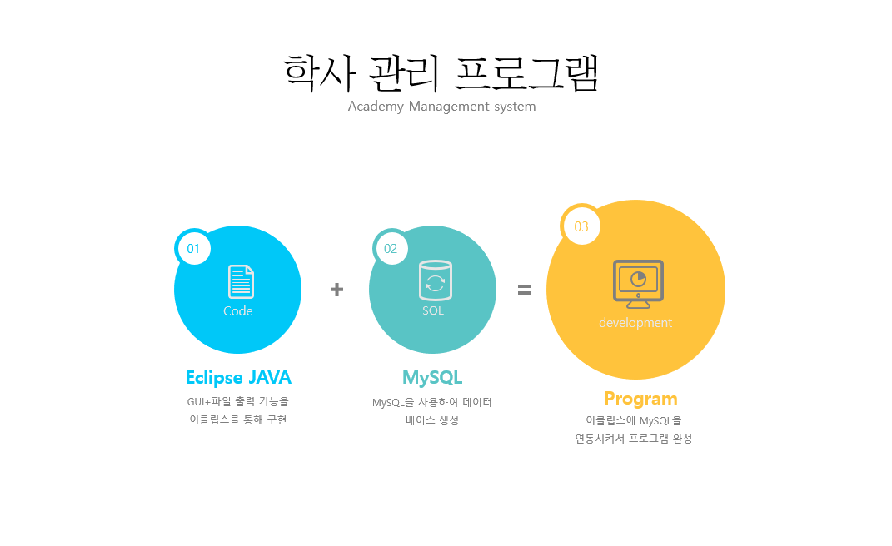
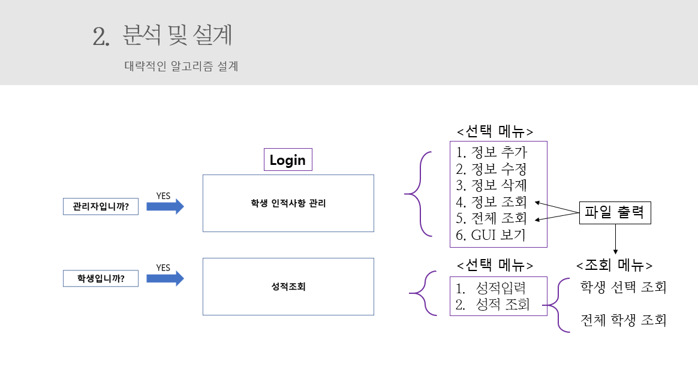
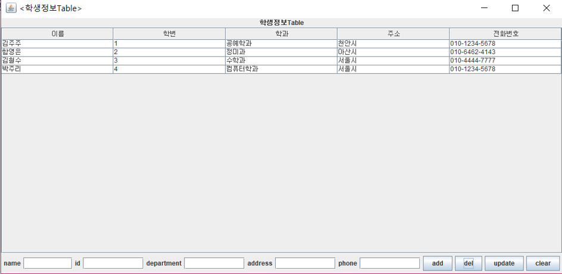
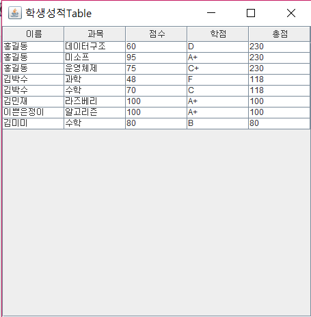
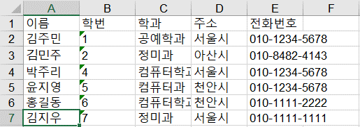

# student-management-system
student management system
## Core java Project Using Java and MYSQL.
## Data base: Mysql
## Project can should be run in eclipse iDE Require mysql connector
## Data can be saved as an Excel file

